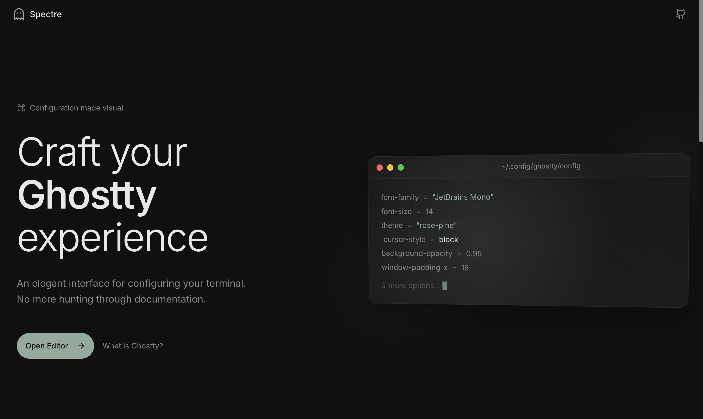
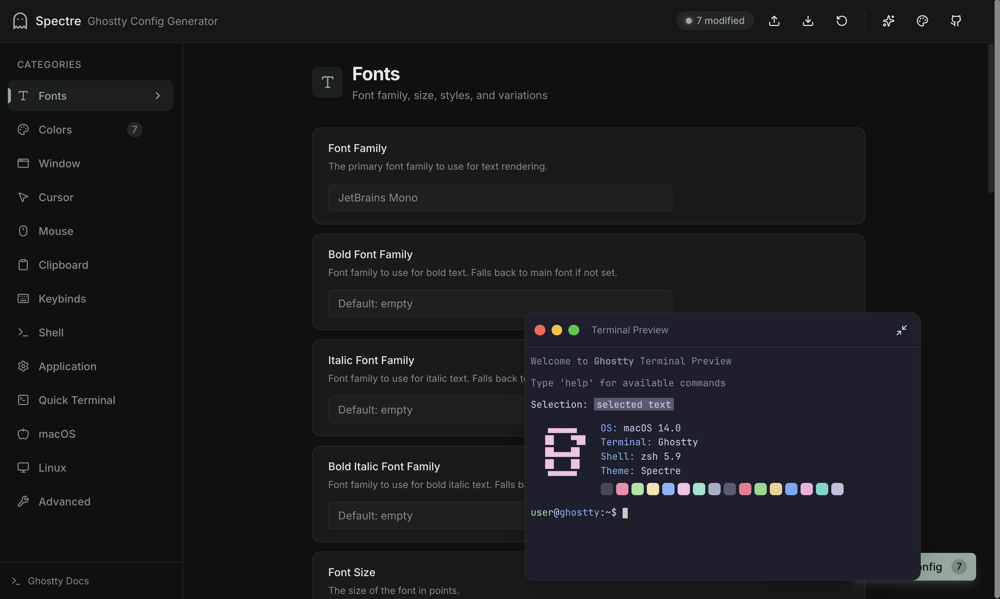
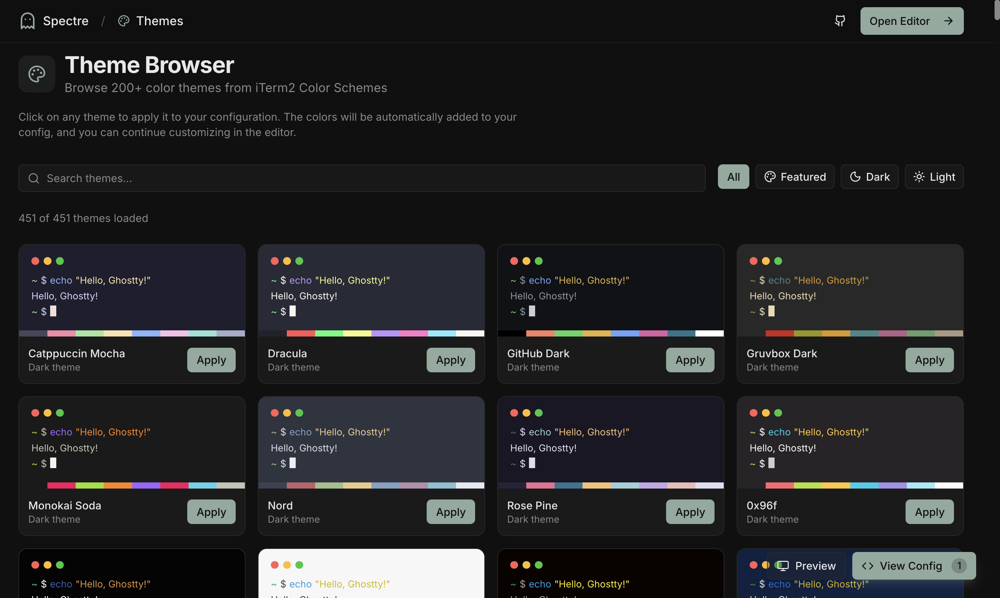

# Spectre - Ghostty Config Generator

<div align="center">
  <h1>👻</h1>
  <h3>A beautiful, modern configuration generator for Ghostty terminal</h3>
  <p>
    <a href="https://ghostty.org">Ghostty</a> •
    <a href="#features">Features</a> •
    <a href="#getting-started">Getting Started</a> •
    <a href="#contributing">Contributing</a>
  </p>
</div>

---

## Features

- 👻 **Real Ghostty Preview** - Live terminal preview powered by [libghostty](https://mitchellh.com/writing/libghostty-is-coming) WASM - see exactly how your config will look!
- 🎨 **Visual Color Editor** - Pick colors with an intuitive color picker and palette editor
- 🎭 **200+ Themes** - Browse and apply themes from iTerm2 Color Schemes with one click
- 🔤 **Font Configuration** - Configure font families, sizes, styles, and OpenType features
- ⌨️ **Keybind Manager** - Create and manage custom keyboard shortcuts
- 📦 **100+ Options** - Support for all Ghostty configuration options
- 💾 **Import/Export** - Import existing configs and export ready-to-use config files
- 🔗 **Shareable URLs** - Share your configuration with others via URL
- 🌙 **Dark Mode** - Beautiful dark interface that matches your terminal aesthetic
- 📱 **Responsive** - Works on desktop and mobile devices

## Screenshots

### Landing Page


### Config Editor with Live Preview


### Theme Browser


## Getting Started

### Online

Visit [spectre-ghostty-config.vercel.app](https://spectre-ghostty-config.vercel.app) to use the tool online.

### Local Development

```bash
# Clone the repository
git clone https://github.com/imrajyavardhan12/spectre-ghostty-config.git
cd spectre-ghostty-config

# Install dependencies
npm install

# Start development server
npm run dev

# Open http://localhost:3000
```

### Build for Production

```bash
npm run build
npm run start
```

## Tech Stack

- **Framework**: [Next.js 15](https://nextjs.org/) (App Router)
- **Language**: [TypeScript](https://www.typescriptlang.org/)
- **Terminal Preview**: [ghostty-web](https://github.com/coder/ghostty-web) (libghostty compiled to WASM)
- **Styling**: [Tailwind CSS](https://tailwindcss.com/)
- **UI Components**: [shadcn/ui](https://ui.shadcn.com/)
- **State Management**: [Zustand](https://zustand-demo.pmnd.rs/)
- **Icons**: [Lucide React](https://lucide.dev/)

## Configuration Categories

| Category | Description |
|----------|-------------|
| **Fonts** | Font family, size, styles, variations |
| **Colors** | Theme, palette, background, foreground |
| **Window** | Decorations, padding, sizing, titlebar |
| **Cursor** | Style, color, blinking behavior |
| **Mouse** | Click behavior, scrolling, hiding |
| **Clipboard** | Copy/paste behavior and protection |
| **Keybinds** | Custom keyboard shortcuts |
| **Shell** | Shell integration, command, environment |
| **Application** | Startup, shutdown, notifications |
| **Quick Terminal** | Quick terminal dropdown settings |
| **macOS** | macOS-specific settings |
| **Linux** | Linux/GTK-specific settings |
| **Advanced** | Scrollback, shaders, image storage |

## Contributing

Contributions are welcome! Please feel free to submit a Pull Request.

1. Fork the repository
2. Create your feature branch (`git checkout -b feature/amazing-feature`)
3. Commit your changes (`git commit -m 'Add some amazing feature'`)
4. Push to the branch (`git push origin feature/amazing-feature`)
5. Open a Pull Request

## Related Projects

- [Ghostty](https://github.com/ghostty-org/ghostty) - The Ghostty terminal emulator
- [zerebos/ghostty-config](https://github.com/zerebos/ghostty-config) - Inspiration for this project

## License

MIT License - see [LICENSE](LICENSE) for details.

---

<div align="center">
  Made with ❤️ for the Ghostty community
</div>
